# Visualização de Dados Pós-Pré-processamento

#### Responsável: `Gregory Ozaki`

## Objetivo

Esta etapa apresenta a análise visual dos datasets após o pré-processamento realizado no Weka. A visualização foi usada como ferramenta analítica, não apenas ilustrativa, para verificar se as transformações aplicadas produziram os efeitos esperados e se os padrões relevantes para a classificação do risco de desperdício ambiental foram preservados.

Foram analisadas duas versões:

```bash
dataset/dataset_preprocessado.arff
dataset/dataset_preprocessado_attrselect.arff
```

A primeira versão corresponde ao dataset preprocessado principal. A segunda corresponde a uma versão complementar gerada com `AttributeSelection`, usada para comparação visual e análise de relevância dos atributos.

As visualizações foram realizadas no Weka com:

```bash
Explorer > Preprocess
Explorer > Visualize
Visualization > BoundaryVisualizer
```

---

## 1. Dataset preprocessado principal

Arquivo analisado:

```bash
dataset/dataset_preprocessado.arff
```

Essa versão foi gerada com:

- `ReplaceMissingValues` para tratamento de valores faltantes;
- `Remove` para remoção de atributos irrelevantes;
- `NumericToNominal` para conversão de `num_gpus`;
- `RemoveUseless`, que não removeu novos atributos;
- `Normalize` para normalização dos atributos numéricos.

---

## 2. Verificação inicial do dataset preprocessado

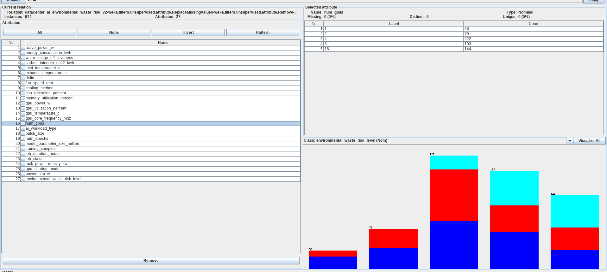

A estrutura do dataset preprocessado indica que a base foi carregada corretamente no Weka, com 674 instâncias e 27 atributos. A redução de 30 para 27 atributos ocorreu devido à remoção dos três atributos administrativos considerados irrelevantes: `manufacturer_sku_id`, `rack_label_color` e `rack_inventory_zone`.

A classe-alvo `environmental_waste_risk_level` foi mantida como nominal, preservando as categorias `baixo`, `moderado` e `alto`.

---

## 3. Verificação do atributo `num_gpus`

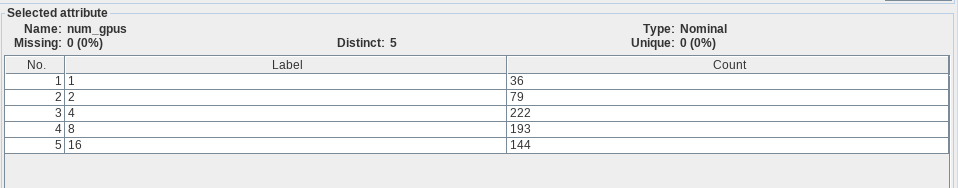

O atributo `num_gpus` foi corretamente convertido para nominal. A distribuição observada foi:

| Valor | Quantidade |
|---:|---:|
| 1 | 36 |
| 2 | 79 |
| 4 | 222 |
| 8 | 193 |
| 16 | 144 |

Essa conversão é coerente porque `num_gpus` representa uma configuração discreta de hardware, e não uma medida contínua como potência, temperatura ou duração. A maior concentração em 4, 8 e 16 GPUs é compatível com um cenário de racks voltados a cargas de IA.

---

## 4. Verificação da normalização

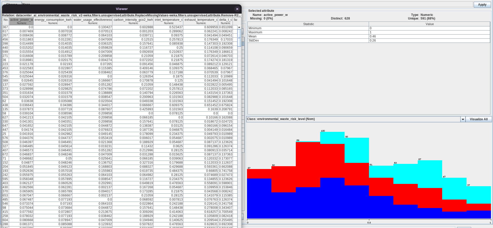

O atributo `active_power_w` apresenta valor mínimo 0 e máximo 1 após a normalização. Isso indica que o filtro `Normalize` foi aplicado corretamente.

A presença de valores iguais a 0 não representa erro: esses valores correspondem aos menores valores originais daquele atributo. A normalização alterou apenas a escala dos dados, preservando a distribuição relativa dos registros.

---

# 5. Análise das distribuições no dataset preprocessado

## 5.1. Distribuição de `active_power_w`

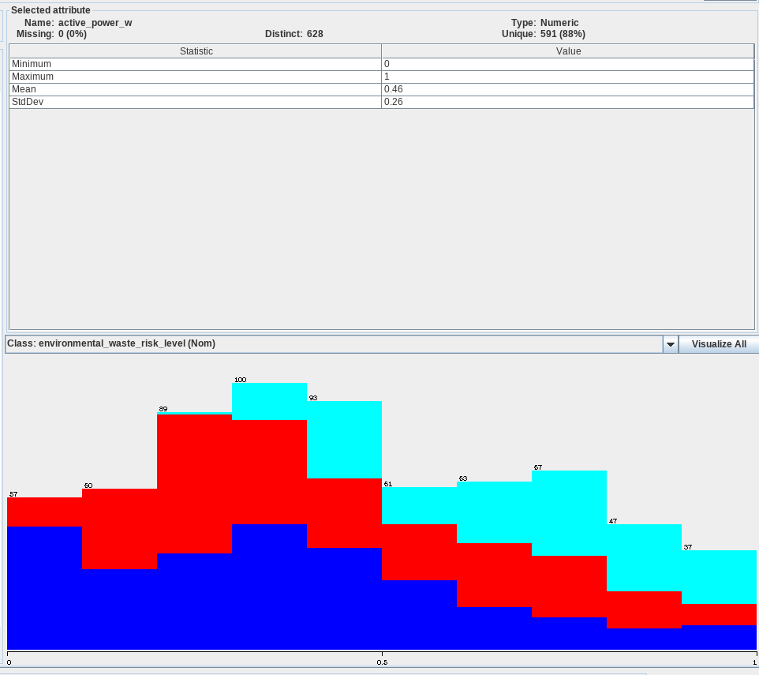

A distribuição de `active_power_w` permanece espalhada ao longo da escala normalizada. As classes aparecem em diferentes faixas, mas há maior presença da classe `baixo` em valores menores e maior presença da classe `alto` em valores mais elevados.

Isso indica que a potência ativa é relevante, mas não separa perfeitamente as classes de forma isolada.

---

## 5.2. Distribuição de `gpu_utilization_percent`

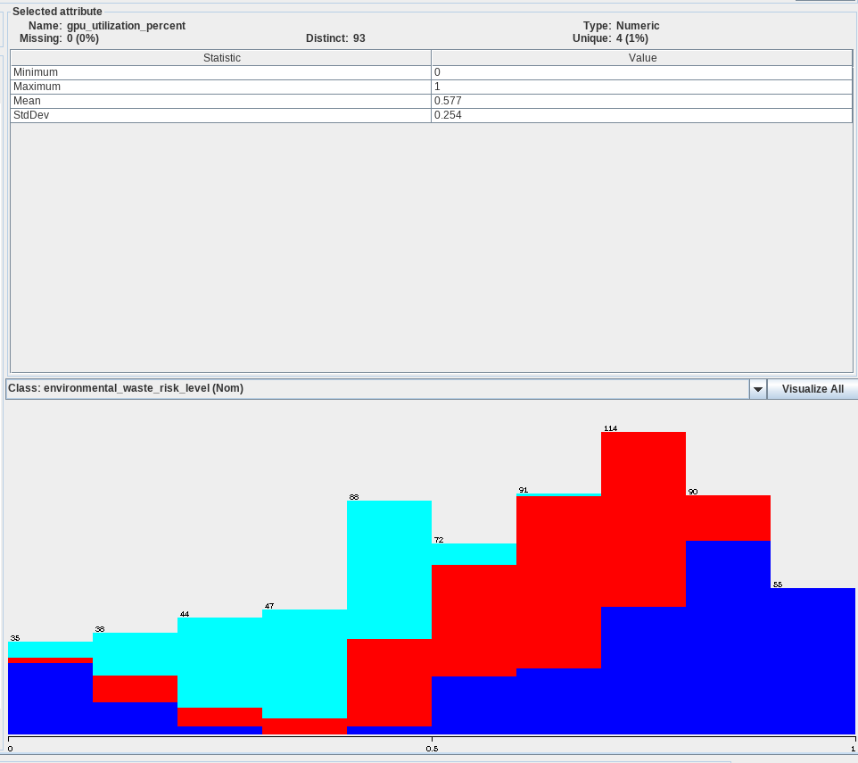

A distribuição de `gpu_utilization_percent` é uma das mais informativas. A classe `baixo` aparece com maior frequência em faixas altas de utilização, enquanto a classe `alto` aparece mais concentrada em faixas baixas ou intermediárias.

Esse comportamento é coerente com a definição do problema: menor utilização da GPU, quando combinada com consumo ou densidade energética elevada, pode indicar desperdício ambiental.

---

## 5.3. Distribuição de `rack_power_density_kw`

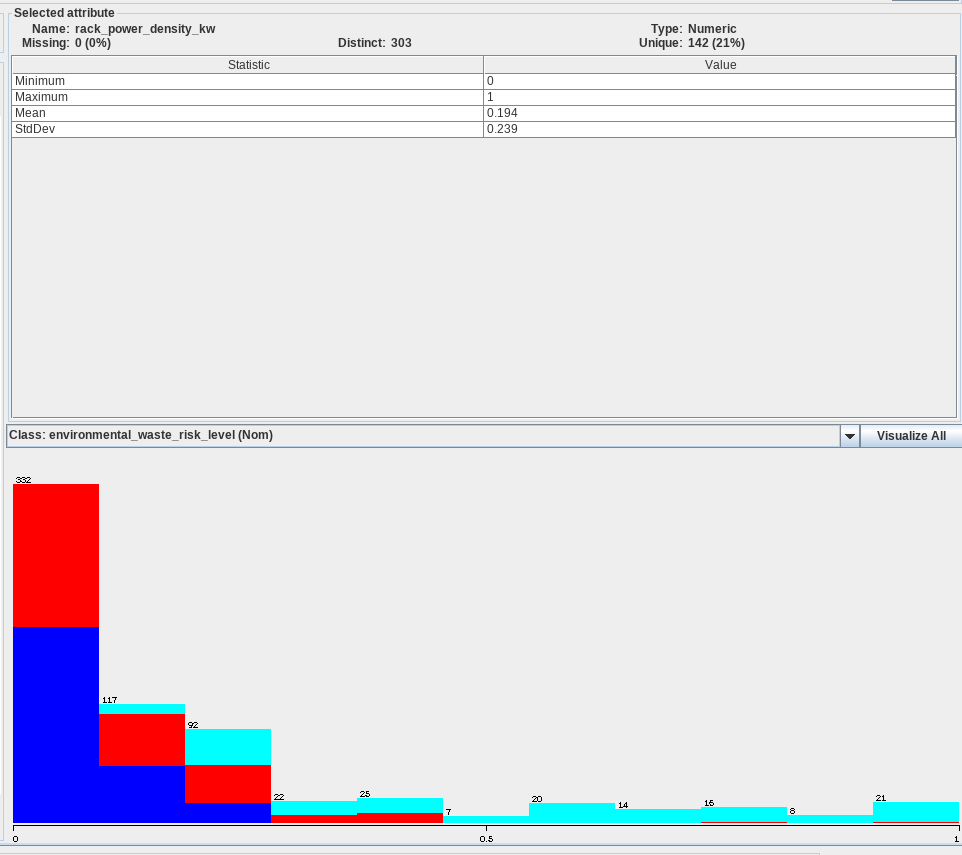

O atributo `rack_power_density_kw` apresenta distribuição assimétrica, com forte concentração em valores baixos e cauda em direção a valores mais altos. As faixas mais elevadas concentram mais registros da classe `alto`.

Esse atributo apresenta forte associação visual com a classe-alvo e deve ser observado com atenção nas próximas etapas, pois pode exercer influência elevada sobre os classificadores.

---

## 5.4. Distribuição de `job_duration_hours`

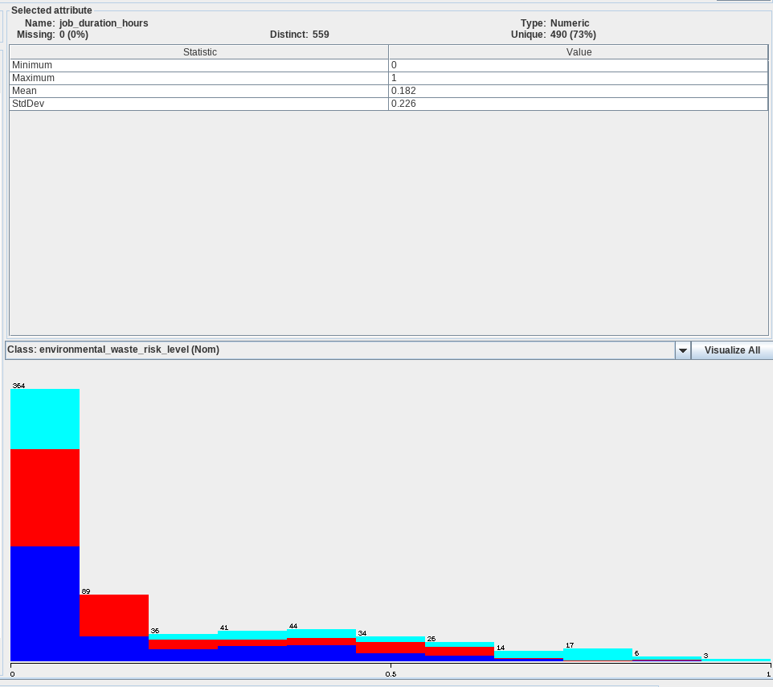

A distribuição de `job_duration_hours` é concentrada em valores baixos, com cauda longa para valores maiores. Isso indica que a maioria dos jobs possui curta duração, mas existem registros de duração elevada.

Os valores mais altos podem representar execuções longas, processos ineficientes ou jobs que permaneceram em execução por tempo excessivo. O atributo tem relevância operacional, mas não apresenta separação tão forte quanto `rack_power_density_kw` e `gpu_utilization_percent`.

---

## 5.5. Distribuição de `water_usage_effectiveness`

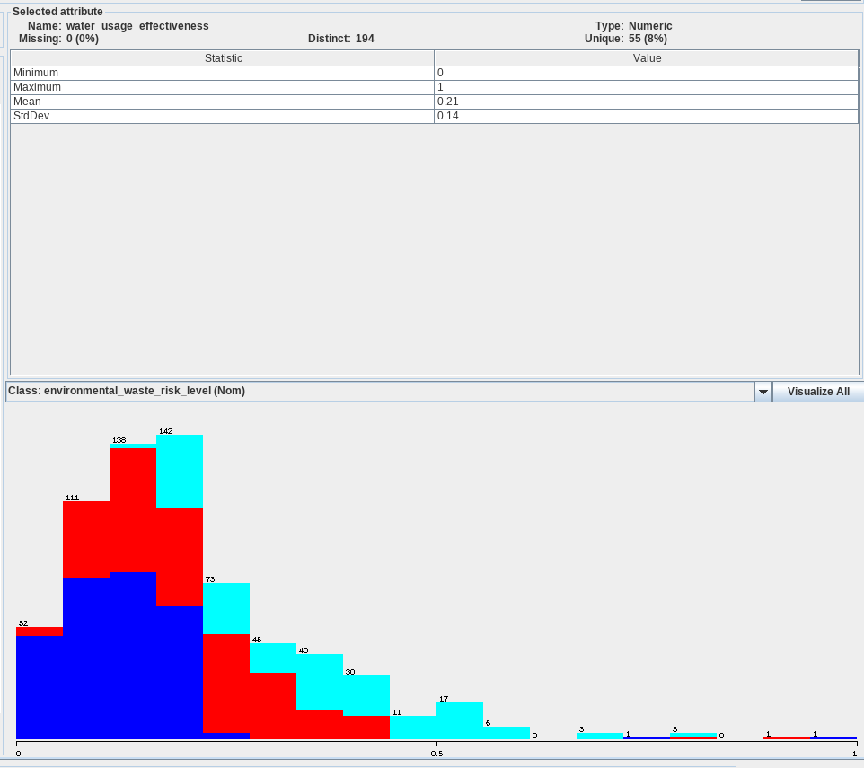

O atributo `water_usage_effectiveness` apresenta concentração em valores baixos e cauda em direção a valores mais altos. Registros da classe `alto` aparecem com maior frequência em faixas elevadas.

Essa distribuição indica que o atributo contribui para representar o impacto ambiental do rack, especialmente em cenários com pior eficiência hídrica.

---

# 6. Relações entre atributos no dataset preprocessado

## 6.1. Relação `active_power_w × energy_consumption_kwh`

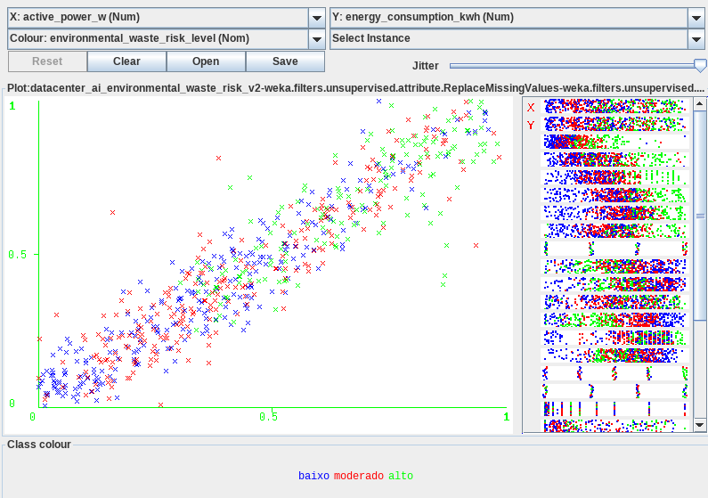

A relação entre `active_power_w` e `energy_consumption_kwh` apresenta tendência linear positiva. Isso confirma a coerência energética do dataset, pois maior potência ativa tende a estar associada a maior consumo energético.

A visualização também sugere redundância parcial entre esses atributos, já que ambos carregam informação semelhante. Mesmo assim, eles foram mantidos na versão principal porque essa relação é esperada no domínio e ajuda a preservar a interpretação física da base.

---

## 6.2. Relação `gpu_power_w × gpu_utilization_percent`

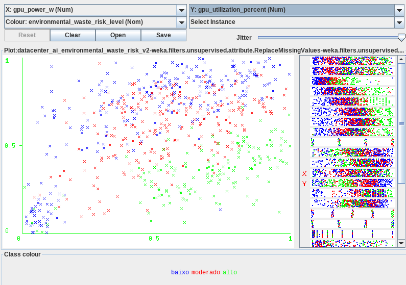

A relação entre potência da GPU e utilização da GPU apresenta dispersão relevante. A classe `baixo` aparece com maior frequência em regiões de alta utilização, enquanto registros da classe `alto` aparecem em regiões de utilização mais baixa ou intermediária.

Essa visualização reforça que o risco de desperdício não depende apenas do consumo, mas da relação entre consumo e aproveitamento computacional.

---

## 6.3. Relação `gpu_temperature_c × fan_speed_rpm`

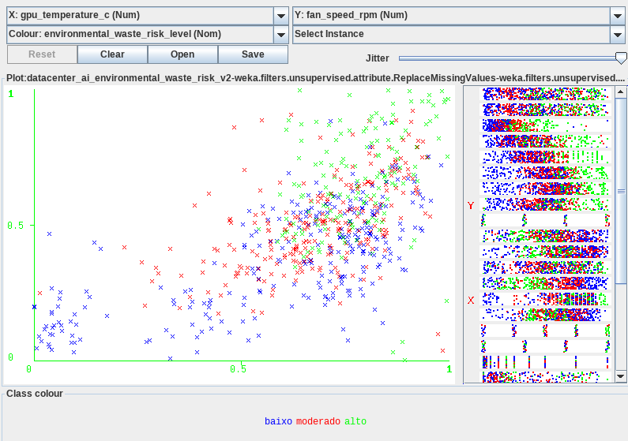

A relação entre temperatura da GPU e rotação dos fans apresenta tendência positiva. Conforme a temperatura aumenta, a rotação dos fans tende a aumentar também.

Isso confirma a coerência térmica da base. A dispersão observada é plausível e pode representar variações operacionais, ruído controlado ou diferentes respostas do sistema de refrigeração.

---

## 6.4. Relação `active_power_w × gpu_utilization_percent`

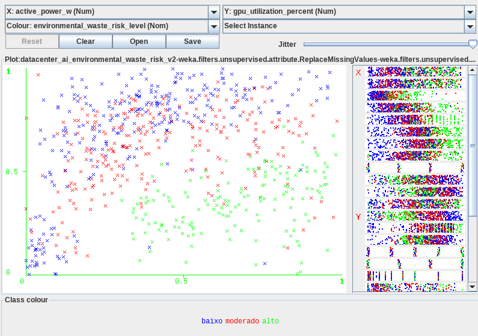

Essa relação é uma das mais importantes do dataset completo. A classe `baixo` aparece mais associada a maior utilização da GPU, enquanto a classe `alto` aparece com maior frequência em situações de menor ou média utilização.

Essa visualização expressa a lógica central do problema: o desperdício ambiental tende a ocorrer quando há consumo relevante sem aproveitamento computacional proporcional.

---

## 6.5. Relação `rack_power_density_kw × environmental_waste_risk_level`

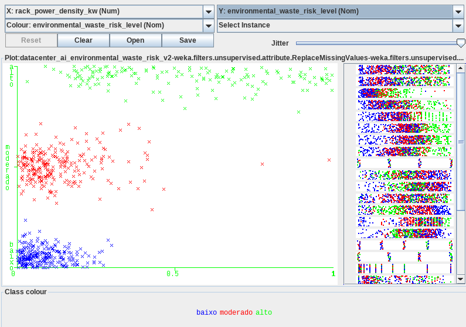

A relação entre `rack_power_density_kw` e a classe-alvo apresenta separação visual forte. A classe `baixo` aparece concentrada em valores menores, enquanto a classe `alto` aparece com maior frequência em faixas mais elevadas de densidade energética.

Essa visualização confirma a relevância do atributo, mas também indica possível dominância. O atributo deve ser considerado importante, mas não como única explicação da classe.

---

## 6.6. Relação `gpu_utilization_percent × environmental_waste_risk_level`

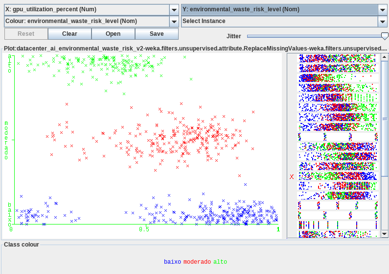

A utilização da GPU apresenta forte relação visual com a classe-alvo. Valores mais altos de utilização estão mais associados à classe `baixo`, enquanto valores mais baixos ou intermediários aparecem mais associados à classe `alto`.

Essa relação é coerente com o domínio, pois alta utilização computacional sugere melhor aproveitamento dos recursos energéticos.

---

## 6.7. Relação `job_duration_hours × job_status`

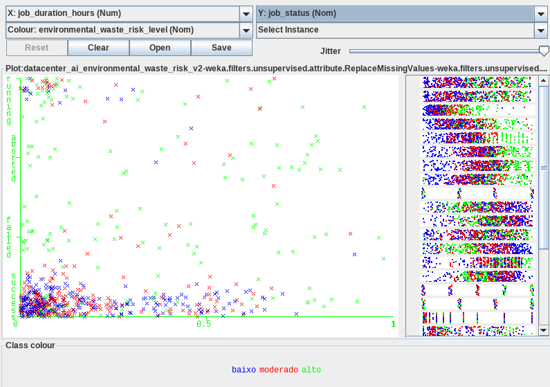

A relação entre duração do job e status mostra concentração de registros em jobs curtos, especialmente em `success`. Casos `failed`, `aborted` e `running` aparecem de forma mais espalhada e com presença de registros da classe `alto`.

Essa relação tem valor complementar. Ela ajuda a caracterizar desperdício operacional, mas não apresenta separação tão forte quanto os atributos de densidade energética e utilização da GPU.

---

# 7. Dataset com `AttributeSelection`

Arquivo analisado:

```bash
dataset/dataset_preprocessado_attrselect.arff
```

Essa versão foi criada com:

```bash
weka.filters.supervised.attribute.AttributeSelection
Evaluator: CfsSubsetEval
Search: BestFirst
```

A seleção manteve os seguintes atributos:

```bash
water_usage_effectiveness
inlet_temperature_c
gpu_utilization_percent
job_status
rack_power_density_kw
environmental_waste_risk_level
```

Essa versão não substitui o dataset principal. Ela foi usada apenas como análise complementar da relevância dos atributos.

---

## 8. Estrutura do dataset com `AttributeSelection`

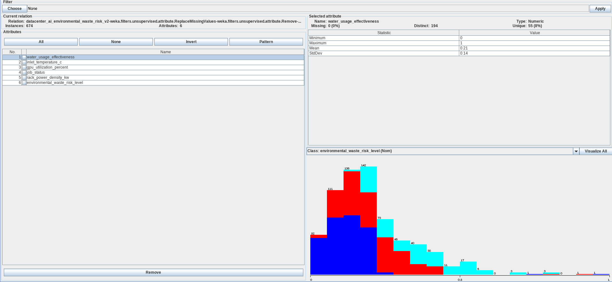

A estrutura mostra que a versão com `AttributeSelection` ficou com 6 atributos, sendo 5 preditores e a classe-alvo.

Essa redução simplifica o dataset, mas também remove atributos semanticamente relevantes, como `active_power_w`, `energy_consumption_kwh`, `gpu_temperature_c`, `fan_speed_rpm` e `job_duration_hours`.

---

# 9. Distribuições no dataset com `AttributeSelection`

## 9.1. Distribuição de `water_usage_effectiveness`

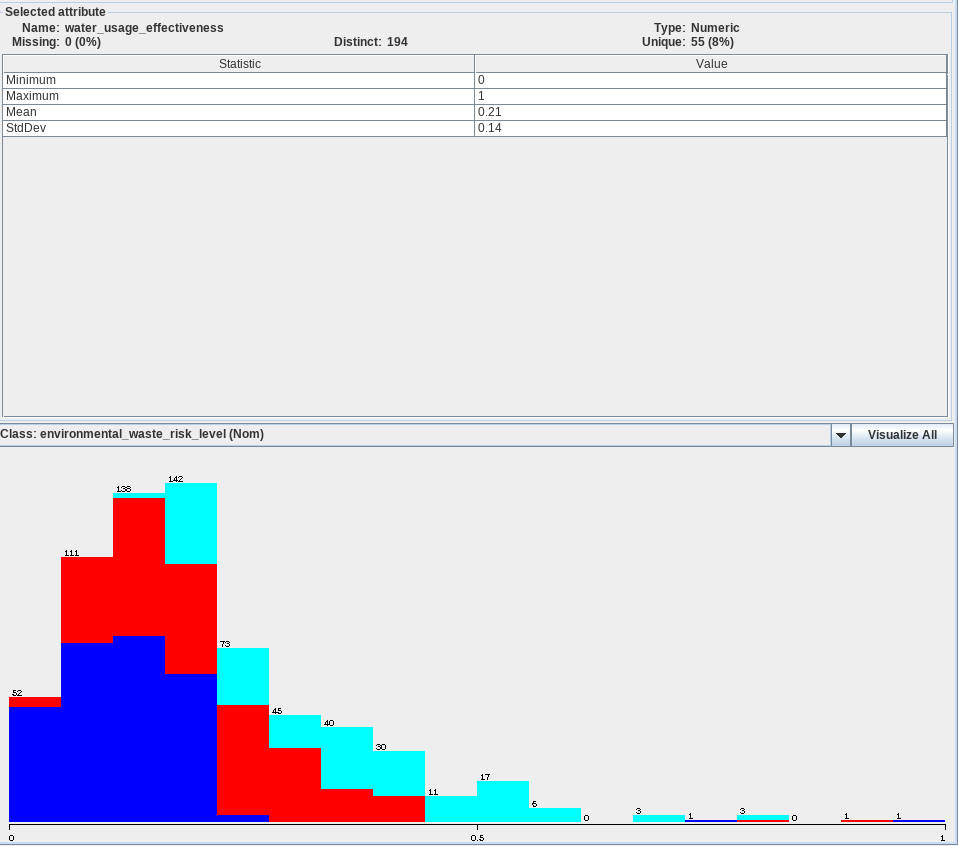

A distribuição de `water_usage_effectiveness` permanece concentrada em valores baixos, com presença da classe `alto` em faixas mais elevadas. Isso reforça sua relevância ambiental.

---

## 9.2. Distribuição de `inlet_temperature_c`

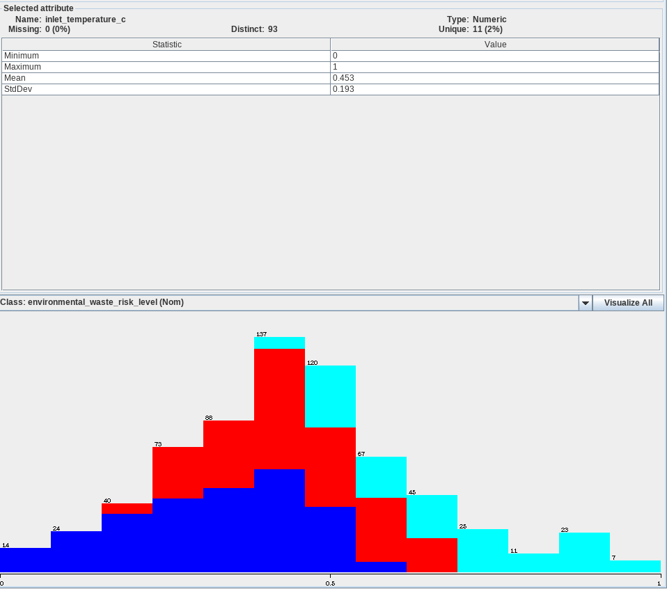

A distribuição de `inlet_temperature_c` mostra concentração em faixas intermediárias e presença mais visível da classe `alto` em valores elevados. Isso indica que a temperatura de entrada contribui para caracterizar condições térmicas menos favoráveis.

---

## 9.3. Distribuição de `gpu_utilization_percent`

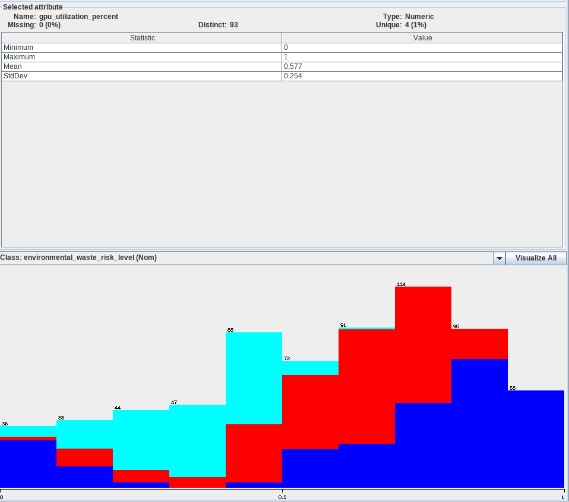

A distribuição de `gpu_utilization_percent` no dataset com `AttributeSelection` é a mesma da versão principal, pois a seleção de atributos remove colunas, mas não altera os valores das instâncias.

Sua presença na versão reduzida confirma que esse atributo foi considerado relevante pelo filtro.

---

## 9.4. Distribuição de `rack_power_density_kw`

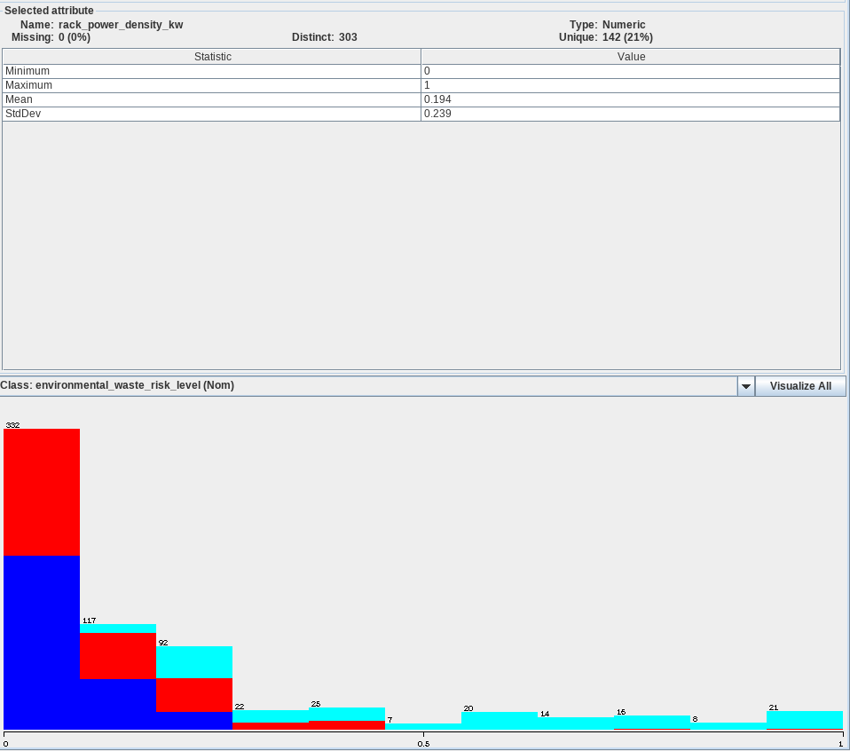

O atributo `rack_power_density_kw` também foi mantido pelo `AttributeSelection`, confirmando sua alta relevância visual e estatística. Ele continua apresentando forte associação com a classe `alto`.

---

# 10. Relações entre atributos no dataset com `AttributeSelection`

## 10.1. Relação `water_usage_effectiveness × inlet_temperature_c`

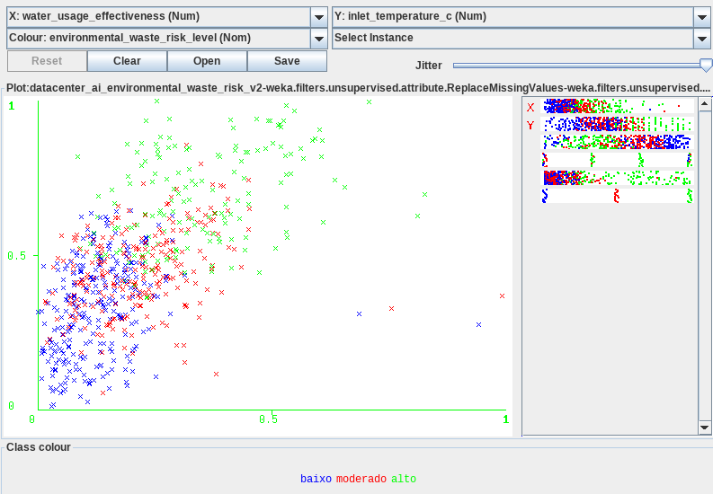

A relação entre eficiência hídrica e temperatura de entrada apresenta tendência coerente. Registros da classe `baixo` aparecem mais associados a valores menores, enquanto a classe `alto` aparece com maior frequência em faixas elevadas.

Essa relação sugere que fatores ambientais e térmicos contribuem para a separação da classe-alvo.

---

## 10.2. Relação `gpu_utilization_percent × rack_power_density_kw`

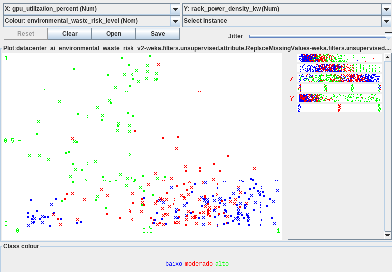

Essa foi a relação mais forte da versão reduzida. A combinação de alta densidade energética com menor utilização da GPU aparece fortemente associada à classe `alto`, enquanto baixa densidade e alta utilização aparecem mais associadas à classe `baixo`.

Esse gráfico resume bem a lógica central do problema: risco ambiental elevado ocorre quando há pressão energética sem aproveitamento computacional proporcional.

---

## 10.3. Relação `rack_power_density_kw × environmental_waste_risk_level`

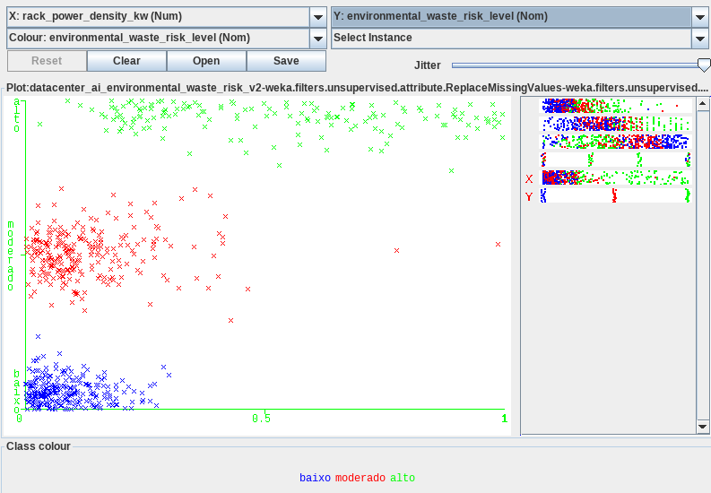

A relação confirma a forte associação entre densidade energética e classe-alvo. A classe `alto` aparece mais concentrada em valores altos, enquanto `baixo` aparece em valores baixos.

---

## 10.4. Relação `gpu_utilization_percent × environmental_waste_risk_level`

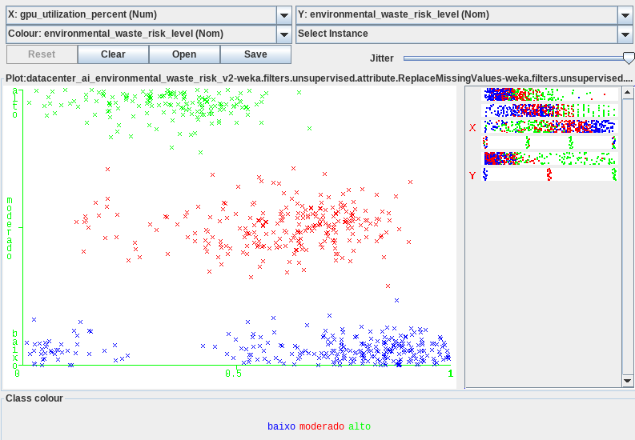

A relação confirma que `gpu_utilization_percent` é um dos atributos mais importantes da base. Valores elevados de utilização estão mais associados à classe `baixo`, enquanto valores mais baixos estão mais associados à classe `alto`.

---

## 10.5. Relação `job_status × environmental_waste_risk_level`

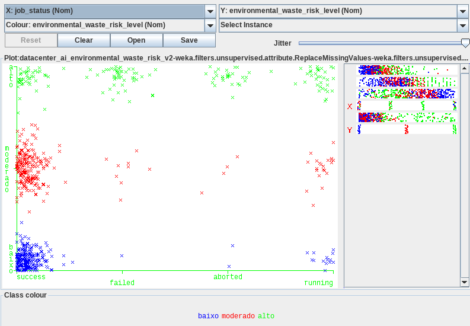

O atributo `job_status` apresenta contribuição complementar. A categoria `success` concentra muitos registros `baixo` e `moderado`, enquanto `failed`, `aborted` e `running` apresentam maior presença relativa de registros críticos.

A separação não é tão forte quanto em `rack_power_density_kw` e `gpu_utilization_percent`, mas o atributo contribui para caracterizar o contexto operacional.

---

# 11. Visualização exploratória com BoundaryVisualizer

O BoundaryVisualizer foi usado para observar fronteiras de decisão em pares de atributos. Essa análise tem caráter exploratório e não substitui a etapa posterior de treino e teste dos algoritmos.

A opção `Plot training data` foi ativada para sobrepor os pontos reais do dataset às regiões de decisão estimadas pelo classificador.

Algumas combinações de algoritmos e atributos apresentaram lentidão ou não concluíram a renderização. Essa limitação foi tratada como restrição da ferramenta de visualização do Weka, não como resultado de desempenho dos classificadores.

---

## 11.1. J48 — `rack_power_density_kw × gpu_utilization_percent`

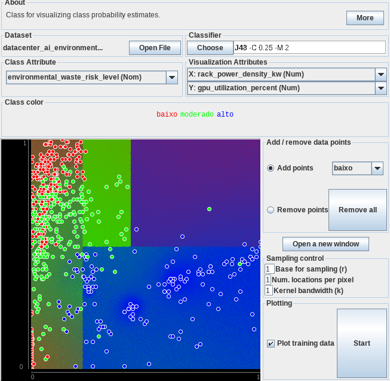

No dataset preprocessado, o J48 criou regiões bem segmentadas para o par `rack_power_density_kw × gpu_utilization_percent`. As fronteiras aparecem em blocos, comportamento esperado para árvores de decisão.

A visualização reforça que esse par de atributos é altamente informativo: baixa densidade energética com alta utilização tende a se aproximar da classe `baixo`, enquanto maior densidade com menor utilização tende a se aproximar da classe `alto`.

---

## 11.2. SMO — `rack_power_density_kw × gpu_utilization_percent`

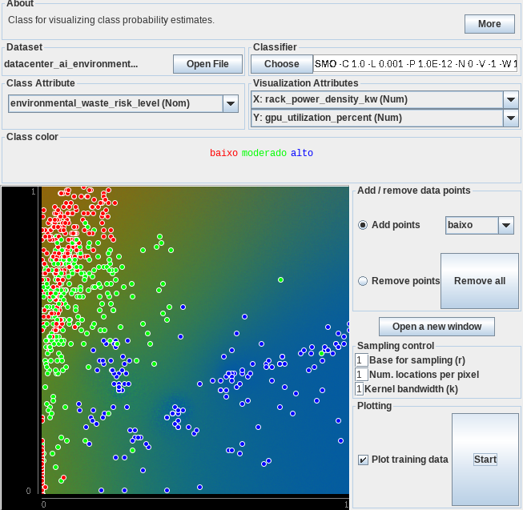

O SMO gerou uma fronteira mais suave e contínua para o mesmo par de atributos. Isso é coerente com o comportamento esperado de classificadores baseados em margem.

A visualização sugere separação geométrica parcial entre as classes, embora ainda exista sobreposição nas regiões intermediárias.

---

## 11.3. J48 — `gpu_temperature_c × fan_speed_rpm`

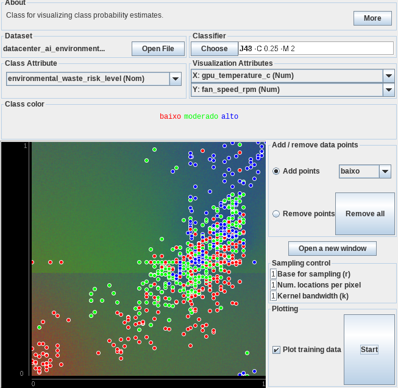

A fronteira gerada pelo J48 nesse par é menos limpa. Os pontos aparecem mais misturados, principalmente na região central.

Isso indica que temperatura da GPU e rotação dos fans são atributos semanticamente coerentes, mas funcionam melhor como sinais complementares do que como separadores principais da classe.

---

## 11.4. J48 — `active_power_w × energy_consumption_kwh`

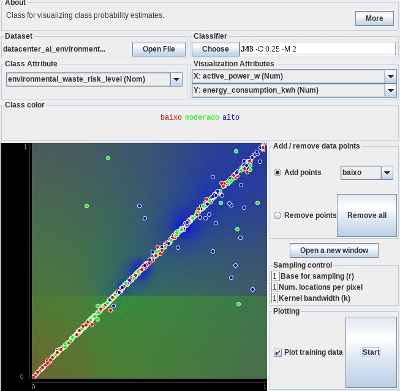

Esse gráfico mostra a forte correlação entre potência ativa e consumo energético. A fronteira gerada pelo J48 confirma que a relação energética foi preservada, mas também evidencia que os dois atributos possuem redundância parcial.

Esse par é útil para validar a coerência do dataset, mas não é o melhor para separar as classes.

---

# 12. BoundaryVisualizer no dataset com `AttributeSelection`

## 12.1. J48 — `rack_power_density_kw × gpu_utilization_percent`

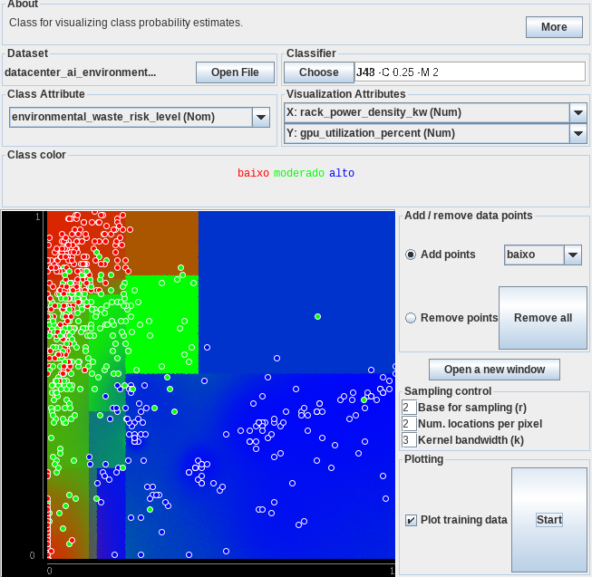

Na versão com `AttributeSelection`, o J48 também gerou fronteiras bem definidas para `rack_power_density_kw × gpu_utilization_percent`. Isso confirma que a seleção preservou um dos pares mais fortes da base.

---

## 12.2. IBk — `rack_power_density_kw × gpu_utilization_percent`

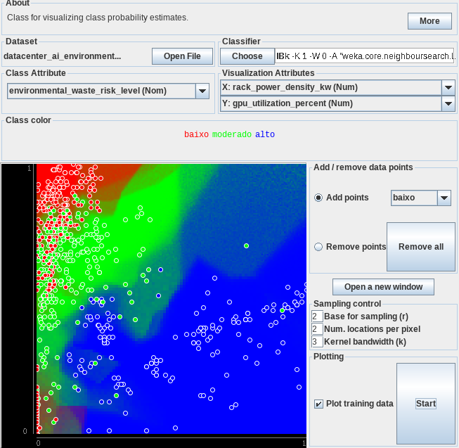

O IBk gerou regiões mais locais e irregulares, comportamento esperado para um classificador baseado em vizinhança. A visualização mostra agrupamentos coerentes, mas também regiões de sobreposição.

Essa análise indica que o IBk pode capturar padrões locais, mas pode ser sensível a regiões misturadas entre classes.

---

## 12.3. J48 — `water_usage_effectiveness × inlet_temperature_c`

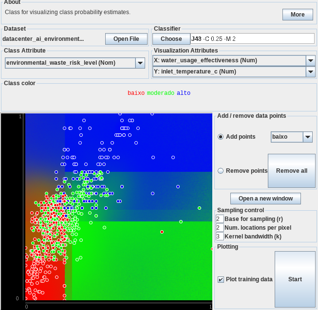

O J48 criou regiões de decisão relativamente interpretáveis nesse par. A relação combina eficiência hídrica e temperatura de entrada, dois atributos ambientais/térmicos mantidos pelo `AttributeSelection`.

A separação é moderada, mas coerente com o domínio.

---

## 12.4. IBk — `water_usage_effectiveness × inlet_temperature_c`

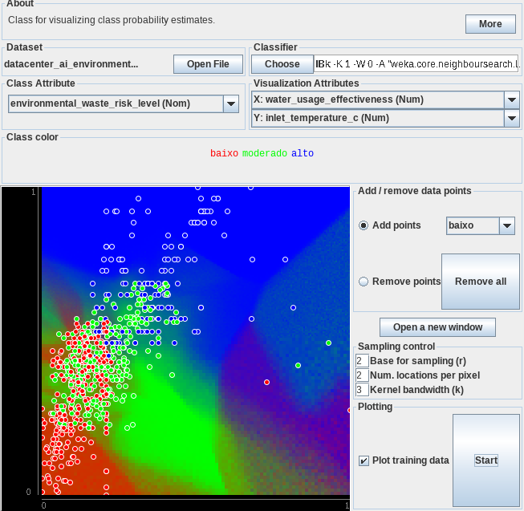

O IBk apresentou fronteiras mais fragmentadas, refletindo sua dependência dos vizinhos locais. A separação existe, mas não é completamente limpa.

Esse resultado reforça que o par possui informação útil, porém com sobreposição entre classes.

---

# 13. Comparação entre os datasets

| Critério | `dataset_preprocessado.arff` | `dataset_preprocessado_attrselect.arff` |
|---|---|---|
| Quantidade de atributos | Maior | Menor |
| Riqueza informacional | Maior | Menor |
| Simplicidade visual | Menor | Maior |
| Relações semânticas preservadas | Mais completas | Mais enxutas |
| Risco de perda de informação | Menor | Maior |
| Uso recomendado | Base principal | Análise complementar |

O dataset preprocessado principal preserva mais relações energéticas, térmicas e operacionais. Ele é mais adequado para representar a complexidade do problema.

O dataset com `AttributeSelection` apresenta uma visão mais enxuta, centrada em atributos visualmente fortes, como `rack_power_density_kw`, `gpu_utilization_percent`, `water_usage_effectiveness` e `inlet_temperature_c`. Porém, a redução remove atributos importantes para interpretação de contexto.

---

# 14. Implicações para os algoritmos

As visualizações sugerem que J48 e Random Forest são candidatos fortes, pois o problema apresenta separações por faixas e combinações de atributos. O J48 apareceu com fronteiras interpretáveis no BoundaryVisualizer, enquanto Random Forest será testado por sua ampla presença na literatura e por sua capacidade de lidar com múltiplas relações, ruídos e interações entre atributos.

O IBk também será testado, pois os dados foram normalizados e há agrupamentos locais visíveis em algumas visualizações. O SMO será considerado por poder explorar separações geométricas em dados normalizados. O Naive Bayes será mantido como baseline probabilístico, embora as visualizações indiquem dependência entre alguns atributos, como `active_power_w` e `energy_consumption_kwh`.

A análise detalhada de desempenho desses algoritmos será realizada posteriormente na etapa de treino e teste.

---

# 15. Síntese geral da visualização

As visualizações indicam que o pré-processamento produziu os efeitos esperados:

| Aspecto analisado | Resultado |
|---|---|
| Valores faltantes | Ausentes após o pré-processamento |
| Atributos irrelevantes | Removidos |
| `num_gpus` | Convertido para nominal |
| Atributos numéricos | Normalizados |
| Relações energéticas | Preservadas |
| Relações térmicas | Preservadas com dispersão plausível |
| Separação entre classes | Parcial, com atributos fortes e sobreposição |
| Dataset com `AttributeSelection` | Mais enxuto, mas com perda de contexto |

---

# 16. Conclusão

A visualização pós-pré-processamento confirmou que os filtros aplicados no Weka corrigiram problemas objetivos sem descaracterizar o dataset. As distribuições e relações entre atributos mostram que os padrões relevantes do domínio foram preservados.

Os atributos `rack_power_density_kw` e `gpu_utilization_percent` foram os mais fortes visualmente, tanto no dataset principal quanto no dataset com `AttributeSelection`. A relação entre densidade energética e utilização da GPU foi a que melhor representou a lógica do problema, pois combina pressão energética com aproveitamento computacional.

A versão `dataset_preprocessado.arff` será mantida como base principal por preservar maior riqueza informacional. A versão `dataset_preprocessado_attrselect.arff` será usada apenas como comparação complementar, pois simplifica o conjunto de atributos e pode remover informações contextuais importantes.

Com isso, o dataset preprocessado está adequado para seguir para a etapa posterior de treino e teste dos classificadores no Weka.
