# Teste Piloto - Dataset Classificação do Nível de Risco de Desperdício Ambiental em Racks de Datacenters Voltados a Cargas de IA.

### Objetivo:
Realizar uma análise exploratória inicial do dataset original antes da aplicação de qualquer técnica de pré-processamento.

### Analisador: Calil Lima

----

## Etapa 1 - Verificação de Integridade Estrutural
### Objetivo da etapa:
Verificar se o dataset está tecnicamente correto, se abre no Weka sem erro e se sua estrutura corresponde ao que foi planejado.

### O que será analisado

| Verificação          | Descrição                                                                         |
| -------------------- | --------------------------------------------------------------------------------- |
| Carregamento no Weka | Verificar se o arquivo `.arff` abre corretamente                                  |
| Número de instancias | Confirmar a quantidade total de registros                                         |
| Número de atributos  | Confirmar se existem 30 atributos                                                 |
| Classe-alvo          | Verificar se `environmental_waste_risk_level` foi reconhecida como nominal        |
| Tipos dos atributos  | Verificar se os atributos numéricos e categóricos foram reconhecidos corretamente |
| Valores faltantes    | Confirmar a presença de `?` nos atributos planejados                              |
| Categorias válidas   | Verificar se atributos nominais possuem apenas categorias previstas               |
| Linhas quebradas     | Verificar se existem registros mal formatados                                     |
| Duplicatas           | Verificar se há registros 100% idênticos em excesso                               |

----

### Carregamento no Weka e verificação de instâncias e atributos:

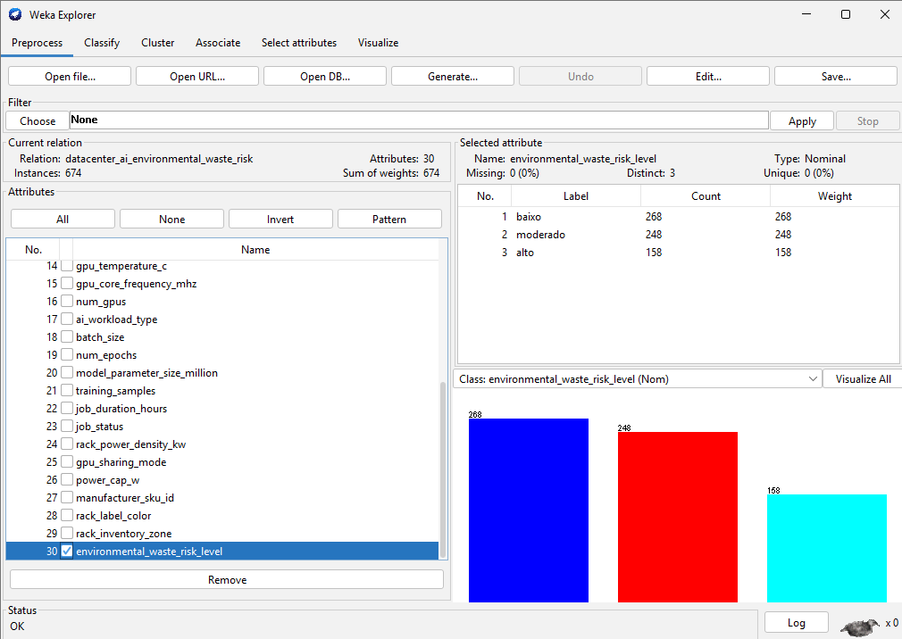

<p align="justify">
O dataset dataset_original.arff foi carregado corretamente no Weka, sem apresentar erros de leitura ou formatação. 
Foram identificadas 674 instâncias e 30 atributos, conforme especificado na metodologia do teste piloto. 
A classe-alvo environmental_waste_risk_level foi reconhecida como nominal, contendo as categorias baixo, moderado e alto. Presença de valores faltantes planejados confirmada.
Os atributos numéricos e categóricos também foram reconhecidos adequadamente, indicando que o arquivo ARFF está estruturalmente válido para a etapa de análise exploratória.
</p>

### Registro de Achados:

| ID | Eixo        | Atributo(s) analisado(s) | Achado observado                       | Evidência                     | Hipótese              | Impacto no pré-processamento | Ação sugerida           |
| -- | ----------- | ------------------------ | -------------------------------------- | ----------------------------- | --------------------- | ---------------------------- | ----------------------- |
| A1 | Integridade | Dataset completo         | Arquivo carregado corretamente no Weka | 674 instâncias e 30 atributos | Estrutura ARFF válida | Dataset apto para análise    | Manter arquivo original |

----

## Etapa 2 - Análise Estatística Descritiva
### Objetivo da etapa:
Investigar o comportamento geral dos atributos numéricos e categóricos, observando médias, dispersões, frequências e distribuições.

### O que será analisado

| Tipo de análise          | Descrição                                                  |
| ------------------------ | ---------------------------------------------------------- |
| Mínimo e máximo          | Verificar se os valores estão dentro das faixas planejadas |
| Média                    | Observar tendência central                                 |
| Mediana                  | Verificar efeito de valores extremos                       |
| Desvio padrão            | Avaliar dispersão                                          |
| Distribuição             | Observar formato dos histogramas                           |
| Frequência de categorias | Verificar distribuição dos atributos nominais              |
| Distribuição da classe   | Verificar quantidade de registros por classe               |

----

### Histogramas dos principais atributos:

#### Atributo active_power_w:

<div align="center">
  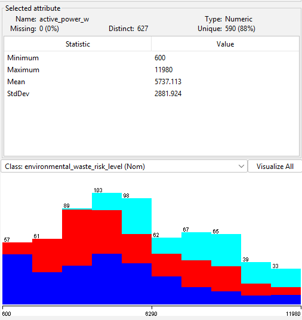
</div>

----

#### Atributo energy_consumption_kwh:

<div align="center">
  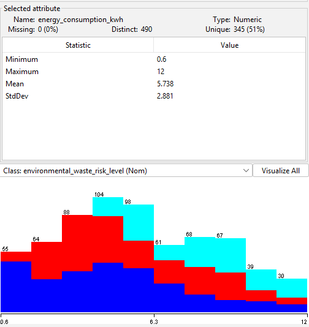
</div>

----

#### Atributo water_usage_effectiveness:

<div align="center">
  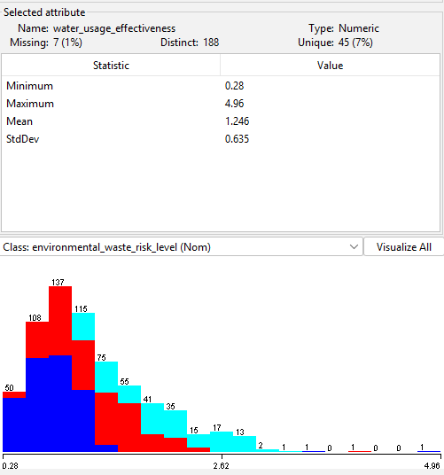
</div>

----

#### Atributo carbon_intensity_gco2_kwh:

<div align="center">
  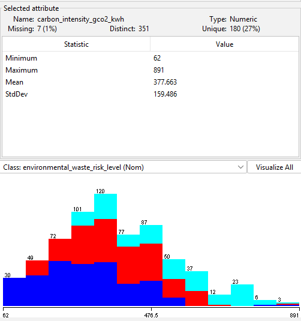
</div>

----

#### Atributo inlet_temperature_c:

<div align="center">
  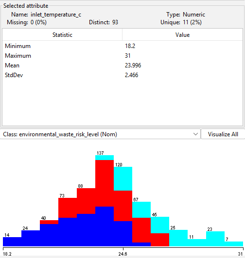
</div>

----

#### Atributo exhaust_temperature_c:

<div align="center">
  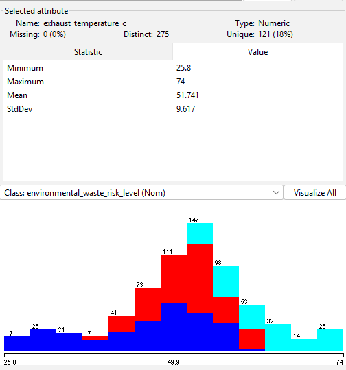
</div>

----

#### Atributo delta_t_c:

<div align="center">
  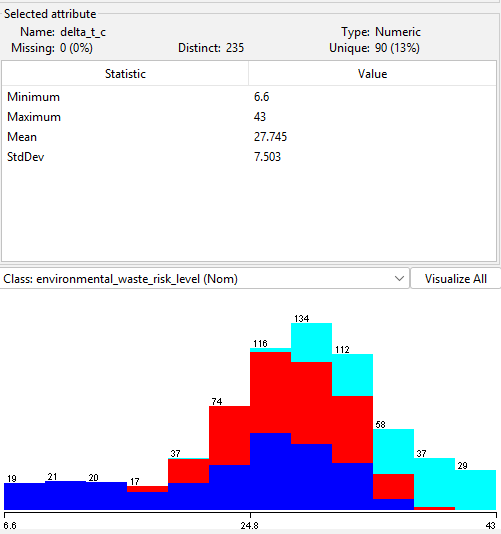
</div>

----

#### Atributo fan_speed_rpm:

<div align="center">
  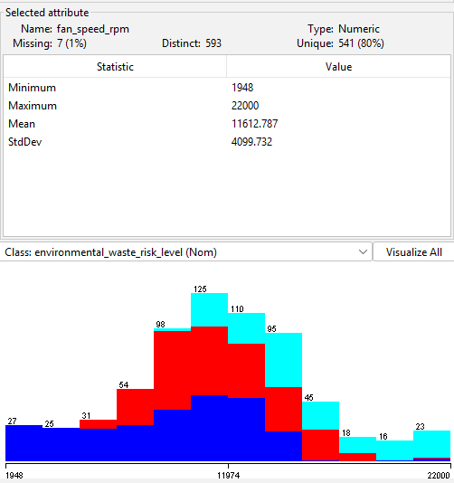
</div>

----

#### Atributo gpu_power_w:

<div align="center">
  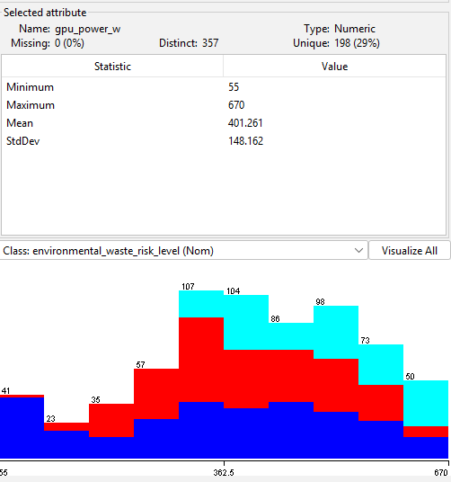
</div>

----

#### Atributo gpu_utilization_percent:

<div align="center">
  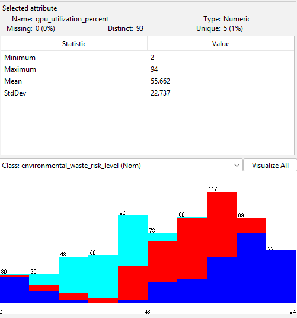
</div>

----

#### Atributo gpu_temperature_c:

<div align="center">
  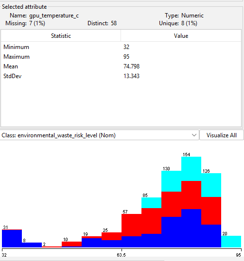
</div>

----

#### Atributo job_duration_hours:

<div align="center">
  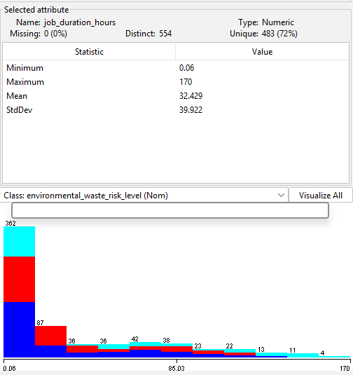
</div>

----

#### Atributo rack_power_density_kw:

<div align="center">
  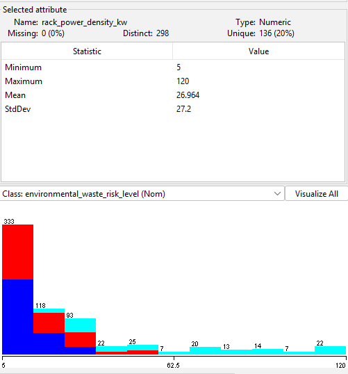
</div>

----

#### Atributo power_cap_w:

<div align="center">
  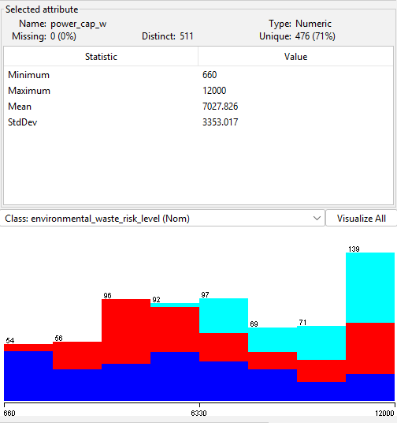
</div>

----


### Estatísticas principais observadas:

| Atributo                    | Mínimo | Máximo |    Média | Interpretação                                    |
| --------------------------- | -----: | -----: | -------: | ------------------------------------------------ |
| `active_power_w`            |    600 |  11980 |  5737,11 | Grande variação de potência                      |
| `energy_consumption_kwh`    |   0,60 |  12,00 |     5,74 | Compatível com operação de 1 hora                |
| `water_usage_effectiveness` |   0,28 |   4,96 |     1,25 | Variação ambiental relevante                     |
| `carbon_intensity_gco2_kwh` |     62 |    891 |   377,66 | Variação significativa de intensidade de carbono |
| `inlet_temperature_c`       |  18,20 |  31,00 |    24,00 | Faixa plausível de entrada                       |
| `exhaust_temperature_c`     |  25,80 |  74,00 |    51,74 | Há temperaturas de exaustão elevadas             |
| `delta_t_c`                 |   6,60 |  43,00 |    27,74 | Grande diferença térmica em alguns racks         |
| `fan_speed_rpm`             |   1948 |  22000 | 11612,79 | Alta dispersão no esforço de refrigeração        |
| `gpu_power_w`               |     55 |    670 |   401,26 | Variação relevante de consumo da GPU             |
| `gpu_utilization_percent`   |      2 |     94 |    55,66 | Existem casos de baixa e alta utilização         |
| `gpu_temperature_c`         |     32 |     95 |    74,80 | Existem temperaturas críticas                    |
| `job_duration_hours`        |   0,06 |    170 |    32,43 | Existem jobs muito longos                        |
| `rack_power_density_kw`     |      5 |    120 |    26,96 | Existem valores extremos de densidade            |
| `power_cap_w`               |    660 |  12000 |  7027,83 | Grande variação de limite de potência            |

### Observações:

Os atributos com maior dispersão e maior chance de comportamento crítico são:

```bash
active_power_w
fan_speed_rpm
gpu_temperature_c
job_duration_hours
rack_power_density_kw
power_cap_w
```

Esses atributos devem receber mais atenção porque podem influenciar diretamente a classificação do risco ambiental.

----

<p align="justify">
  A análise estatística descritiva revelou grande variação em atributos energéticos, térmicos e operacionais. 
  A potência ativa variou de 600 W a 11980 W, enquanto o consumo energético variou de 0,60 kWh a 12,00 kWh. 
  Também foram observados valores elevados em gpu_temperature_c, fan_speed_rpm, job_duration_hours e rack_power_density_kw, 
  indicando a presença de registros extremos que podem representar situações críticas de operação. 
  Esses valores não devem ser removidos automaticamente, 
  pois podem estar associados ao próprio fenômeno investigado: o desperdício ambiental em racks de datacenters voltados a cargas de IA.
</p>

### Registro de Achados:

| ID | Eixo                   | Atributo(s) analisado(s)                                                         | Achado observado             | Evidência                          | Hipótese                                    | Impacto no pré-processamento | Ação sugerida                                         |
| -- | ---------------------- | -------------------------------------------------------------------------------- | ---------------------------- | ---------------------------------- | ------------------------------------------- | ---------------------------- | ----------------------------------------------------- |
| A2 | Estatística descritiva | `active_power_w`, `fan_speed_rpm`, `job_duration_hours`, `rack_power_density_kw` | Alta dispersão nos atributos | Histogramas e estatísticas do Weka | Existem cargas operacionais muito distintas | Pode exigir normalização     | Avaliar normalização em algoritmos sensíveis à escala |

----

## Etapa 3 - Análise de Valores Faltantes
### Objetivo da etapa:
Verificar se os valores faltantes foram inseridos conforme o planejamento e levantar hipóteses sobre o tratamento posterior.

### O que sera analisado

| Verificação                     | Descrição                                                    |
| ------------------------------- | ------------------------------------------------------------ |
| Quantidade de valores faltantes | Contar quantos `?` existem no dataset                        |
| Atributos afetados              | Verificar em quais colunas aparecem valores faltantes        |
| Proporção de faltantes          | Verificar se está próxima da proporção planejada             |
| Distribuição por classe         | Observar se faltantes aparecem concentrados em alguma classe |
| Impacto potencial               | Avaliar se os faltantes afetam atributos críticos            |

----

### Atributos candidatos a valores faltantes

```bash
gpu_temperature_c
fan_speed_rpm
water_usage_effectiveness
carbon_intensity_gco2_kwh
job_status
```

### Distribuição de valores faltantes:

#### Atributo gpu_temperature_c:

<div align="center">
  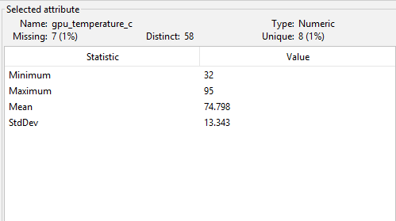
</div>

----

#### Atributo fan_speed_rpm:

<div align="center">
  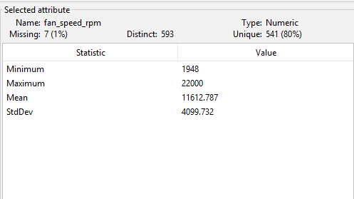
</div>

----

#### Atributo water_usage_effectiveness

<div align="center">
  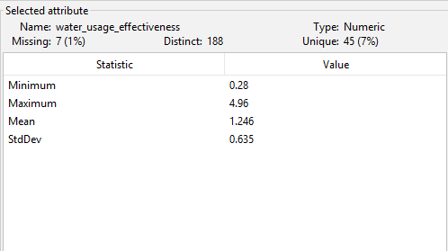
</div>

----

#### Atributo carbon_intensity_gco2_kwh:

<div align="center">
  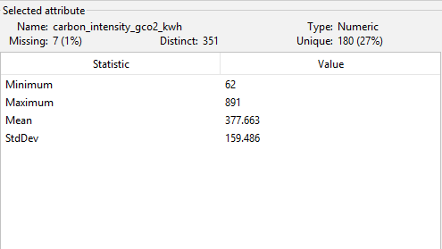
</div>

----

#### Atributo job_status:

<div align="center">
  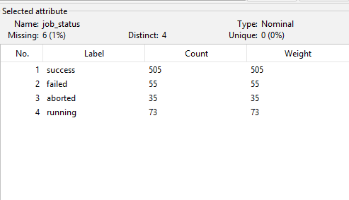
</div>

----

### Valores Faltantes Identificados:

| Atributo                    | Quantidade de faltantes | Percentual | Observação                      |
| --------------------------- | ----------------------: | ---------: | ------------------------------- |
| `gpu_temperature_c`         |                       7 |      1,04% | Atributo térmico crítico        |
| `fan_speed_rpm`             |                       7 |      1,04% | Atributo ligado à refrigeração  |
| `water_usage_effectiveness` |                       7 |      1,04% | Indicador ambiental             |
| `carbon_intensity_gco2_kwh` |                       7 |      1,04% | Indicador ambiental             |
| `job_status`                |                       6 |      0,89% | Atributo categórico operacional |

### Distribuição dos Faltante por Classe:

| Atributo                    | Distribuição observada                     |
| --------------------------- | ------------------------------------------ |
| `gpu_temperature_c`         | 4 em `alto`, 2 em `baixo`, 1 em `moderado` |
| `fan_speed_rpm`             | 5 em `baixo`, 2 em `moderado`              |
| `water_usage_effectiveness` | 6 em `baixo`, 1 em `alto`                  |
| `carbon_intensity_gco2_kwh` | 3 em `moderado`, 3 em `baixo`, 1 em `alto` |
| `job_status`                | 3 em `alto`, 3 em `moderado`               |

### Observações
Os valores faltantes estão em baixa quantidade, aproximadamente 1%. Isso indica que a ausência de dados é controlada. Porém, os atributos afetados são importantes, principalmente os térmicos e ambientais.

<p align="justify">
  Foram identificados valores faltantes apenas nos atributos previstos pela metodologia do teste piloto. Os atributos gpu_temperature_c, fan_speed_rpm, water_usage_effectiveness e carbon_intensity_gco2_kwh apresentaram 7 valores faltantes cada, correspondendo a aproximadamente 1,04% do dataset. O atributo categórico job_status apresentou 6 valores faltantes, correspondendo a aproximadamente 0,89% dos registros. A baixa proporção indica que os faltantes foram inseridos de forma controlada, não comprometendo a estrutura geral do dataset. Entretanto, como esses atributos possuem importância operacional, térmica e ambiental, recomenda-se tratá-los posteriormente antes da etapa de treinamento dos modelos.
</p>

### Decisão Futura Sugerida:

| Tipo de atributo | Técnica sugerida                     |
| ---------------- | ------------------------------------ |
| Numérico         | Substituir por média ou mediana      |
| Categórico       | Substituir pela moda                 |
| Weka             | Testar filtro `ReplaceMissingValues` |

### Registro de Achados:

| ID | Eixo      | Atributo(s) analisado(s)                                                                                     | Achado observado              | Evidência                | Hipótese                                              | Impacto no pré-processamento          | Ação sugerida                                          |
| -- | --------- | ------------------------------------------------------------------------------------------------------------ | ----------------------------- | ------------------------ | ----------------------------------------------------- | ------------------------------------- | ------------------------------------------------------ |
| A3 | Faltantes | `gpu_temperature_c`, `fan_speed_rpm`, `water_usage_effectiveness`, `carbon_intensity_gco2_kwh`, `job_status` | Valores faltantes controlados | Cerca de 1% por atributo | Simulação de falha de medição ou ausência de registro | Exige tratamento antes do treinamento | Aplicar `ReplaceMissingValues` ou imputação específica |

----

## Etapa 4 - Análise de Ruído
### Objetivo da Etapa:
Verificar se o ruído inserido no dataset é leve, plausível e compatível com o domínio.

### O que sera analisado

| Verificação                | Descrição                                                                            |
| -------------------------- | ------------------------------------------------------------------------------------ |
| Pequenas oscilações        | Observar variações plausíveis em atributos numéricos                                 |
| Coerência potência-energia | Verificar relação entre `active_power_w` e `energy_consumption_kwh`                  |
| Coerência térmica          | Verificar relação entre `inlet_temperature_c`, `exhaust_temperature_c` e `delta_t_c` |
| Valores fora de faixa      | Verificar se o ruído gerou valores inválidos                                         |
| Impacto na classe          | Observar se o ruído tornou algum registro incoerente                                 |

### Atributos candidatos a ruído

```bash
active_power_w
energy_consumption_kwh
gpu_power_w
cpu_utilization_percent
memory_utilization_percent
gpu_utilization_percent
inlet_temperature_c
exhaust_temperature_c
gpu_temperature_c
delta_t_c
fan_speed_rpm
gpu_core_frequency_mhz
```

### Comparação de atributos relacionados:

#### Relação 1 - Potencia x Energia

<div align="center">
  
</div>

### Observação econtrada
| Relação                                     | Resultado                      |
| ------------------------------------------- | ------------------------------ |
| `active_power_w` × `energy_consumption_kwh` | Relação muito forte e coerente |
| Correlação aproximada                       | 0,999                          |

<p align="justify">
  A relação entre active_power_w e energy_consumption_kwh mostrou-se altamente coerente, pois o consumo energético acompanha diretamente a potência ativa. Como cada instância representa uma hora de operação, essa relação era esperada. Pequenas variações podem ser interpretadas como ruído controlado e não indicam erro estrutural.
</p>

----

#### Relação 2 - Temperaturas x Delta T

<div align="center">
  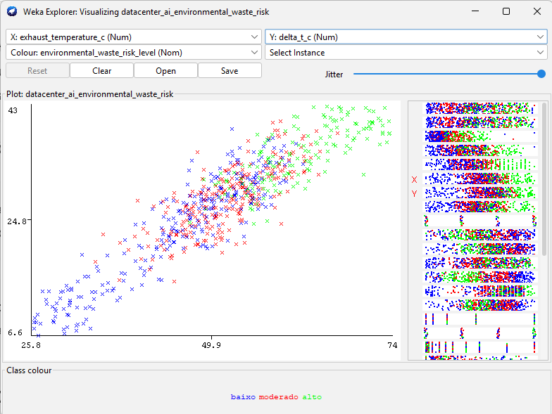
</div>

----

<div align="center">
  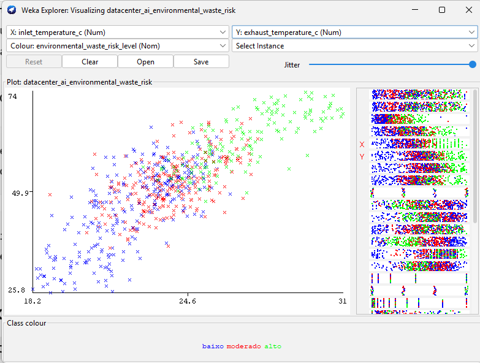
</div>

### Observação encontrada

| Relação                               | Resultado                |
| ------------------------------------- | ------------------------ |
| `exhaust_temperature_c` × `delta_t_c` | Relação forte e coerente |
| Inconsistências relevantes            | Apenas casos pontuais    |

<p align="Justify">
  A relação entre inlet_temperature_c, exhaust_temperature_c e delta_t_c apresentou coerência geral. O delta_t_c acompanha a diferença térmica entre a temperatura de exaustão e a temperatura de entrada. Foram observadas pequenas variações pontuais, mas elas não caracterizam erro estrutural grave, podendo ser interpretadas como ruído controlado.
</p>

----

#### Relação 3 - Percentuais de utilização

#### cpu_utilization_percent:

<div align="center">
  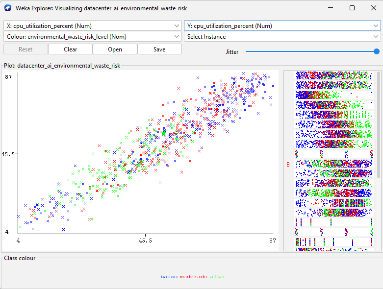
</div>

----

#### memory_utilization_percent:

<div align="center">
  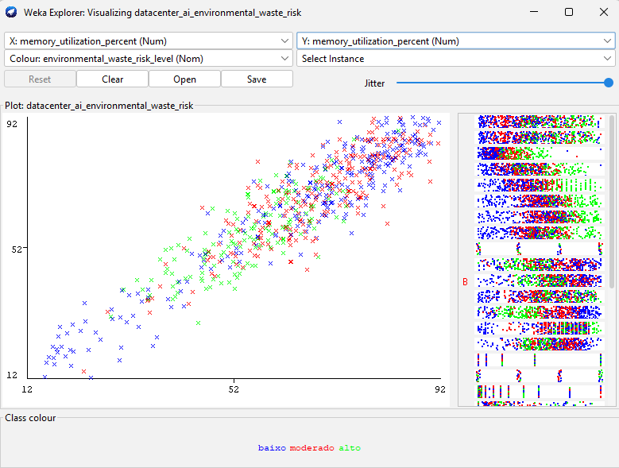
</div>

----

#### gpu_utilization_percent:

<div align="center">
  
</div>

### Valores observados

| Atributo                     | Mínimo | Máximo | Situação          |
| ---------------------------- | -----: | -----: | ----------------- |
| `cpu_utilization_percent`    |      4 |     87 | Dentro de 0 a 100 |
| `memory_utilization_percent` |     12 |     92 | Dentro de 0 a 100 |
| `gpu_utilization_percent`    |      2 |     94 | Dentro de 0 a 100 |

<p align="justify">
  Os atributos percentuais permaneceram dentro do intervalo esperado de 0 a 100, não sendo identificados valores inválidos. Isso indica que o ruído inserido não gerou inconsistências críticas nos campos de utilização de CPU, memória e GPU.
</p>

### Registro de Achados:

| ID | Eixo  | Atributo(s) analisado(s)                      | Achado observado                                 | Evidência                       | Hipótese                           | Impacto no pré-processamento | Ação sugerida             |
| -- | ----- | --------------------------------------------- | ------------------------------------------------ | ------------------------------- | ---------------------------------- | ---------------------------- | ------------------------- |
| A4 | Ruído | Potência, energia, temperaturas e percentuais | Ruído plausível e sem valores inválidos críticos | Gráficos e estatísticas do Weka | Variações simulam oscilações reais | Não exige remoção imediata   | Manter ruído inicialmente |

----

## Etapa 5 - Análise de Outliers
### Objetivos da etapa:
Identificar outliers e avaliar se eles são interpretáveis, planejados e úteis para a tarefa de classificação.

### O que será analisado

| Verificação          | Descrição                                                          |
| -------------------- | ------------------------------------------------------------------ |
| Outliers numéricos   | Valores extremos em atributos como potência, temperatura e duração |
| Outliers relacionais | Combinações incomuns entre atributos                               |
| Outliers por classe  | Verificar se estão concentrados apenas em uma classe               |
| Plausibilidade       | Avaliar se os outliers têm interpretação no domínio                |
| Decisão futura       | Manter, tratar ou remover no pré-processamento                     |

### Tipos de outliers esperados

| Tipo de outlier   | Exemplo                                                  |
| ----------------- | -------------------------------------------------------- |
| Energético        | Alta potência com baixa utilização de CPU/GPU            |
| Térmico           | Temperatura elevada mesmo com fan speed alto             |
| Operacional       | `job_status = failed` ou `aborted` com longa duração     |
| Ambiental         | Alto consumo com alta intensidade de carbono ou alto WUE |
| Refrigeração      | Fan speed alto com baixa carga computacional             |
| Alocação de GPU   | `full_gpu` com baixa utilização de GPU                   |
| Densidade de rack | Alta densidade com refrigeração inadequada               |

#### Verificação outliers por histogramas

#### gpu_temperature_c:

<div align="center">
  
</div>

----

#### fan_speed_rpm:

<div align="center">
  
</div>

----

#### job_duration_hours:

<div align="center">
  
</div>

----

#### rack_power_density_kw:

<div align="center">
  
</div>

----

#### Verificação outliers por relações

#### Relação gpu_utilization_percent × gpu_power_w:

<div align="center">
  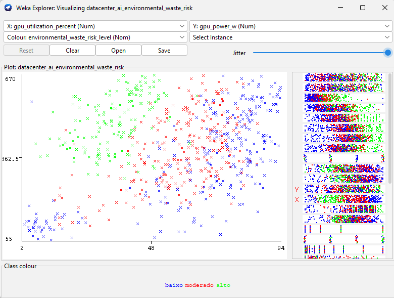
</div>

----

#### Relação fan_speed_rpm × gpu_temperature_c:

<div align="center">
  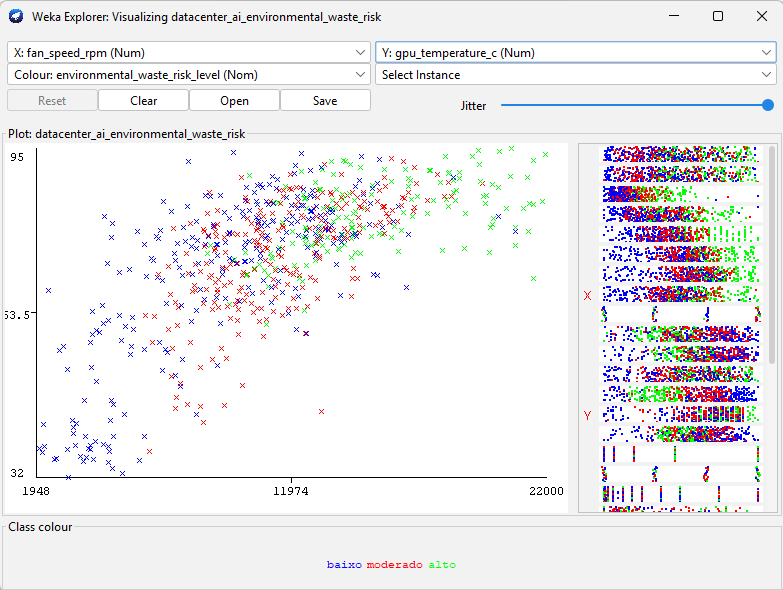
</div>

----

#### Relação rack_power_density_kw × environmental_waste_risk_level:

<div align="center">
  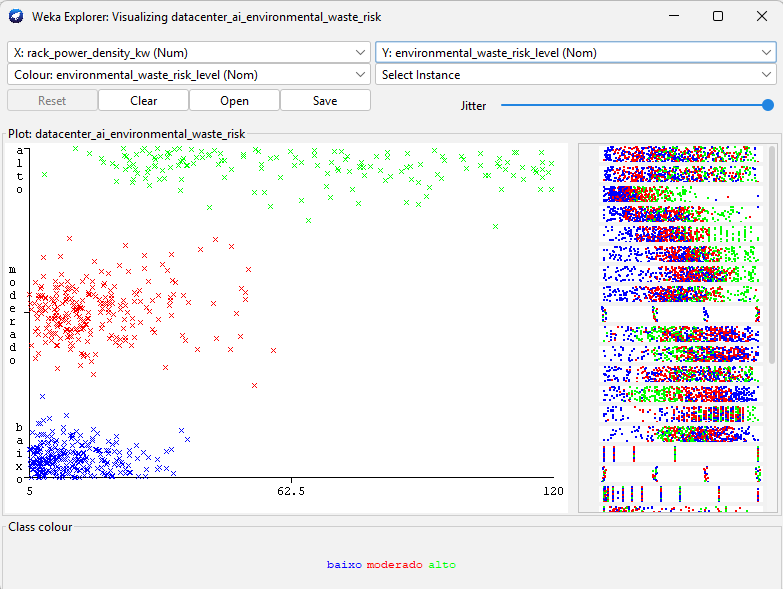
</div>

----

### Outliers observados

| Atributo ou relação                       | Outlier observado                     | Interpretação                         | Ação sugerida                 |
| ----------------------------------------- | ------------------------------------- | ------------------------------------- | ----------------------------- |
| `gpu_temperature_c`                       | Valores até 95 °C                     | Temperatura elevada em carga intensa  | Manter inicialmente           |
| `fan_speed_rpm`                           | Valores até 22000 RPM                 | Esforço extremo de refrigeração       | Manter e avaliar impacto      |
| `job_duration_hours`                      | Valores até 170 h                     | Jobs longos podem indicar desperdício | Manter como caso crítico      |
| `rack_power_density_kw`                   | Valores até 120 kW                    | Alta densidade energética do rack     | Manter, mas testar dominância |
| `gpu_utilization_percent` × `gpu_power_w` | Baixa utilização com potência elevada | Desperdício energético plausível      | Manter como padrão relevante  |

<p align="justify">
  Foram identificados valores extremos em atributos térmicos, energéticos e operacionais. A temperatura da GPU atingiu até 95 °C, a velocidade das ventoinhas chegou a 22000 RPM, a duração de jobs chegou a 170 horas e a densidade de potência do rack chegou a 120 kW. Apesar de extremos, esses valores são interpretáveis no domínio de datacenters com cargas intensivas de IA. Por esse motivo, não devem ser removidos automaticamente, pois podem representar exatamente os casos de maior risco de desperdício ambiental.
</p>

### Registro de achados

| ID | Eixo     | Atributo(s) analisado(s)                                                            | Achado observado                | Evidência           | Hipótese                  | Impacto no pré-processamento                   | Ação sugerida       |
| -- | -------- | ----------------------------------------------------------------------------------- | ------------------------------- | ------------------- | ------------------------- | ---------------------------------------------- | ------------------- |
| A5 | Outliers | `gpu_temperature_c`, `fan_speed_rpm`, `job_duration_hours`, `rack_power_density_kw` | Valores extremos interpretáveis | Histogramas do Weka | Casos críticos planejados | Podem ser importantes para detectar risco alto | Manter inicialmente |

----

## Etapa 6 - Análise da Classe-Alvo
### Objetivo da etapa:
Verificar como a classe `environmental_waste_risk_level` está distribuída e se há separação excessiva entre as classes.

### O que será analisado

| Verificação                | Descrição                                                                      |
| -------------------------- | ------------------------------------------------------------------------------ |
| Distribuição das classes   | Quantidade de registros `baixo`, `moderado` e `alto`                           |
| Sobreposição entre classes | Verificar se atributos aparecem em faixas compartilhadas                       |
| Atributos dominantes       | Identificar se uma variável separa a classe sozinha                            |
| Casos de fronteira         | Observar registros próximos entre `baixo` e `moderado`, ou `moderado` e `alto` |
| Coerência semântica        | Avaliar se a classe é justificável pela combinação de atributos                |

### Atributos importantes para observar por classe

```bash
active_power_w
energy_consumption_kwh
water_usage_effectiveness
carbon_intensity_gco2_kwh
fan_speed_rpm
gpu_utilization_percent
gpu_power_w
gpu_temperature_c
job_duration_hours
job_status
rack_power_density_kw
gpu_sharing_mode
power_cap_w
```

#### Histograma da classe-alvo

<div align="center">
  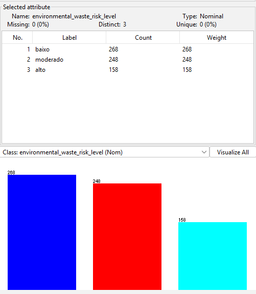
</div>

----

#### Distribuição da classe
| Classe     | Quantidade | Percentual |
| ---------- | ---------: | ---------: |
| `baixo`    |        268 |     39,76% |
| `moderado` |        248 |     36,80% |
| `alto`     |        158 |     23,44% |

A classe alto tem menos registros, mas não está ausente. Portanto, existe um desbalanceamento moderado, não extremo.

----

#### Principais relações:

#### active_power_w × energy_consumption_kwh:

<div align="center">
  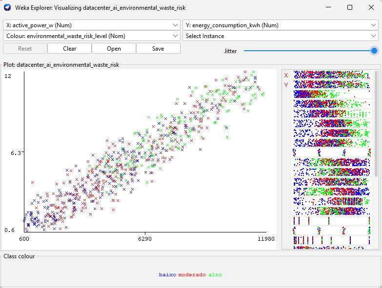
</div>

----

#### gpu_utilization_percent × gpu_power_w:

<div align="center">
  
</div>

----

#### gpu_temperature_c × fan_speed_rpm:

<div align="center">
  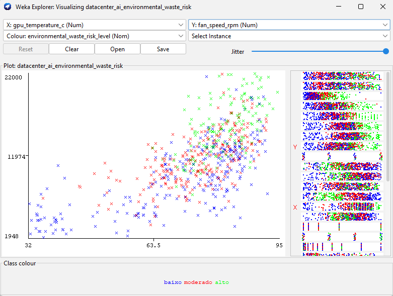
</div>

----

#### rack_power_density_kw × active_power_w:

<div align="center">
  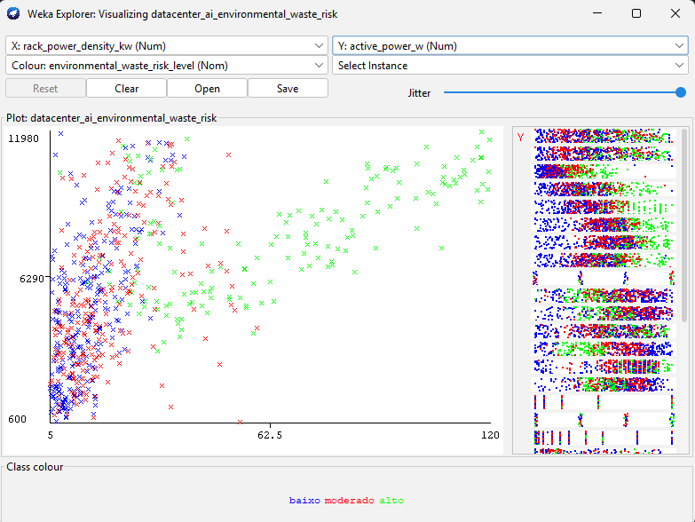
</div>

----

#### Médias por classe:

| Classe     | Potência média | Energia média | GPU util. média | GPU power média | Temp. GPU média | Duração média | Densidade média |
| ---------- | -------------: | ------------: | --------------: | --------------: | --------------: | ------------: | --------------: |
| `baixo`    |      4754,05 W |      4,75 kWh |          65,31% |        354,34 W |        70,41 °C |       27,45 h |        12,76 kW |
| `moderado` |      5396,77 W |      5,39 kWh |          58,33% |        392,16 W |        74,89 °C |       27,26 h |        17,93 kW |
| `alto`     |      7938,79 W |      7,96 kWh |          35,11% |        495,13 W |        82,22 °C |       49,00 h |        65,24 kW |

### Interpretação principal
A classe `alto` apresenta:

* maior potência média;
* maior consumo energético;
* maior temperatura média da GPU;
* maior duração média dos jobs;
* maior densidade média de potência;
* menor utilização média de GPU.

Isso é coerente com o problema, porque risco alto de desperdício ambiental pode ocorrer quando há alto consumo com baixa utilização efetiva.

<p align="justify">
A classe-alvo apresentou as três categorias previstas: baixo, moderado e alto. A classe baixo possui 268 registros, a classe moderado possui 248 registros e a classe alto possui 158 registros. Embora a classe alto seja menos representada, o desbalanceamento não é extremo. A análise das médias por classe mostrou coerência semântica, pois a classe alto apresenta maior potência, maior consumo energético, maior temperatura de GPU, maior duração dos jobs e maior densidade de potência, ao mesmo tempo em que apresenta menor utilização média de GPU. Esse comportamento é compatível com a ideia de desperdício ambiental.
</p>

### Registro de Achados:

| ID | Eixo        | Atributo(s) analisado(s)         | Achado observado                    | Evidência                            | Hipótese                  | Impacto no pré-processamento      | Ação sugerida                                         |
| -- | ----------- | -------------------------------- | ----------------------------------- | ------------------------------------ | ------------------------- | --------------------------------- | ----------------------------------------------------- |
| A6 | Classe-alvo | `environmental_waste_risk_level` | Classe `alto` é menor, mas presente | baixo: 268, moderado: 248, alto: 158 | Desbalanceamento moderado | Pode afetar avaliação dos modelos | Usar matriz de confusão, precision, recall e F1-score |

----

## Etapa 7 - Análise dos Atributos Irrelevantes
### Objetivo da etapa:
Verificar se os atributos irrelevantes planejados realmente não apresentam relação clara com a classe-alvo.

### O que será analisado

| Verificação           | Descrição                                                  |
| --------------------- | ---------------------------------------------------------- |
| Frequência geral      | Distribuição dos valores de cada atributo                  |
| Frequência por classe | Verificar se algum valor aparece concentrado em uma classe |
| Relação com a classe  | Observar se há padrão artificial                           |
| Decisão futura        | Confirmar remoção ou manutenção temporária                 |

### Atributos analisados

```bash
manufacturer_sku_id
rack_label_color
rack_inventory_zone
```


